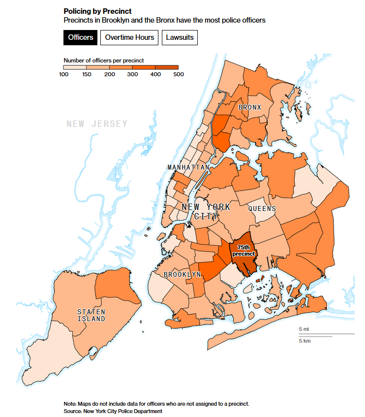

```{r setup, include=FALSE, message=FALSE, warning=FALSE}
knitr::opts_chunk$set(echo = TRUE, warning=FALSE, message=FALSE,comment=NA,fig.align="center")
```

```{r echo=FALSE, message=FALSE, warning=FALSE}
library(rvest)
library(sf)
library(tidyverse)
library(tidyr)
library(lubridate)
```

## Introduction and Background

The goal of this analysis is to study the NYC Open Data data set on film permits from the perspective of the NYPD. To do this, we will utilize two data sets: 

1) [Film permit data provided by the Mayor’s Office of Media and Entertainment, detailing film permits for media production activity from 2012-2020](https://data.cityofnewyork.us/City-Government/Film-Permits/tg4x-b46p)

2) [NYPD precinct map data](https://data.cityofnewyork.us/Public-Safety/Police-Precincts/78dh-3ptz)

Permits are required with productions that use large equipment in public locations or production vehicles that require parking privileges. Additionally, any production that needs exclusive use of NYC-owned property or uses prop weapons, prop vehicles, actors in police uniform or stunts are required to file a permit. Most uses of a permit require the assistance of the NYPD Movie/TV Unit, which provides its services free of charge to media productions, from posting No Parking Orders to lending NYPD presence for safety and crowd-control purposes. Therefore, any NYPD precinct that serves an area for which a large number of film permits are filed will have to dedicate resources towards handling the privileges provided to production crews. 

## Which Precincts Had to Deal with the Most Number of Film Permits Filed Historically?

```{r}
film_permits = read.csv("Film_Permits.csv")

film_permits_precinct = film_permits %>% 
  separate_rows("PolicePrecinct.s.")

film_permits_precinct$Precinct = film_permits_precinct$PolicePrecinct.s. 


film_permits_precinct = filter(film_permits_precinct,film_permits_precinct$Precinct > 0)
film_permits_precinct = filter(film_permits_precinct,film_permits_precinct$Precinct != "N")
film_permits_precinct = filter(film_permits_precinct,film_permits_precinct$Precinct != "A")

FilmPermitsbyPrecinct = film_permits_precinct %>%
  count(Precinct) %>%
  rename("Total Film Permits" = "n")

boxplot(FilmPermitsbyPrecinct$`Total Film Permits`, main = "Total Film Permits")

```
To clean the dataset, a film permit listing multiple precincts is treated as multiple film permits; i.e., one film permit for each precinct in the filing. A minimal number of film permits (54 out of 96,088) had their precinct listed as blank, "0" or "N/A", and those film permits were removed from the dataset. After cleaning the data, the box plot above shows that a large number of precincts are at the lower end of the number of film permits - the minimum, first quartile and median are close together while precincts dealing with an above-median number of film permits are more spread out. In particular, we see five clear outliers of precincts handling more than 4,000 permits.


```{r include=FALSE, message=FALSE, warning=FALSE}
loc = "~/Baruch/STA9750 - Basic Software Tools/nypp_21d"
Precinct_Map = st_read(loc, layer = "nypp")
```

```{r}
Precinct_Map = select(Precinct_Map, Precinct, geometry)
Precinct_Map$Precinct = as.character(Precinct_Map$Precinct)
PrecinctsAndPermits = inner_join(x = Precinct_Map, y = FilmPermitsbyPrecinct)
plot(PrecinctsAndPermits["Total Film Permits"])
```
The map clearly shows where the outliers are - three of the precincts serve northwestern Brooklyn, southwestern Queens and southern Manhattan, and two serve a large area of Midtown Manhattan.

## Of the Precincts Handling the Most Film Permits, What Percentage of the Total Number of Film Permits Are They Handling?

```{r}
Sorted = arrange(FilmPermitsbyPrecinct,desc(`Total Film Permits`))
Sorted = Sorted%>%
  mutate(Percentage=`Total Film Permits`/sum(`Total Film Permits`)*100)

head(Sorted,5)

```

In the table above, the five outliers are sorted by total film permits. We see that 6.5% of precincts (five out of 77 total precincts) are handling approximately 36.16% of all film permits filed in NYC during this period. When we analyze where these precincts are, it makes sense:

1) Precinct 94 serves Greenpoint, which anyone in the NYC film and TV industry knows is the most popular filming location for many media productions due to the low street traffic and varied external backdrops, including different types of building architecture and scenic locations by the East River. It is also the home of several production studios where TV and movie productions take place.

2) Precinct 18 serves northern Midtown Manhattan, which includes popular entertainment locations such as the Theatre District, Radio City Music Hall and Rockefeller Plaza.

3) Precinct 108 serves Long Island City, another area that is home to several production studios. 

4) Precinct 14 serves southern Midtown Manhattan, which includes several NYC landmarks and entertainment locations. For example, the area the precinct covers includes Times Square, one of the most iconic NYC locations; Madison Square Garden, a premier entertainment and sports venue; Koreatown, one of the most popular late-night clubbing scenes; and the Empire State Building, another iconic NYC location.

5) Precinct 1 serves southern Manhattan, which includes recognizable landmarks such as One World Trade Center and the New York Stock Exchange, as well as the picturesque waterfront of Battery Park from where one has a clear view of the Statue of Liberty. 

We see from the above that the precincts handling the most film permits also serve areas that either have production studios or well-known spots, so it looks like these permits are either for productions in studios or for filming at recognizable NYC locations.

## Are the Precincts Handling the Most Film Permits Also the Precincts Handling Film Permits with the Longest Durations?

```{r}
film_permits_precinct$StartDateTime = as.POSIXct(film_permits_precinct$StartDateTime,
                                                 format = "%m/%d/%Y %I:%M:%S %p",
                                                 tz = "America/New_York")

film_permits_precinct$EndDateTime = as.POSIXct(film_permits_precinct$EndDateTime,
                                               format = "%m/%d/%Y %I:%M:%S %p",
                                               tz = "America/New_York")

film_permits_precinct = film_permits_precinct %>%
  mutate("Duration of Film Permits" = difftime(film_permits_precinct$EndDateTime,
                                               film_permits_precinct$StartDateTime,
                                               units = "days"))

AverageDurationsbyPrecinct = film_permits_precinct %>%
  group_by(Precinct) %>%
  summarise(AverageDuration = mean(`Duration of Film Permits`))

TotalDurationsbyPrecinct = film_permits_precinct %>%
  group_by(Precinct) %>%
  summarise(TotalDuration = sum(`Duration of Film Permits`))

DurationsbyPrecinct = inner_join(x = TotalDurationsbyPrecinct,
                                 y = AverageDurationsbyPrecinct)

DurationsbyPrecinct$AverageDuration = as.numeric(DurationsbyPrecinct$AverageDuration)
DurationsbyPrecinct$TotalDuration = as.numeric(DurationsbyPrecinct$TotalDuration)

boxplot(DurationsbyPrecinct$TotalDuration, main = "Total Duration")


```
Each film permit specifies start and end dates that the production requested the permit be valid. After cleaning the data, the box plot above shows the total number of days of all film permits by precinct. We see that there are seven outliers handling more than 2,800 days of valid film permits. 

```{r}
PrecinctsAndPermits = inner_join(x = Precinct_Map, y = DurationsbyPrecinct)
plot(PrecinctsAndPermits["TotalDuration"])
```
From the map above, we clearly see that the five precinct areas that had the most number of total film permits filed are also the areas with the most total number of days that film permits were valid. However, there are two additional areas in Manhattan that are outliers in terms of total duration.
\newpage

## Of the Precincts with the Highest Number of Days, What Percentage of the Total Duration Are They Handling?

```{r}
Sorted2 = arrange(DurationsbyPrecinct,desc(TotalDuration))
Sorted2 = Sorted2%>%
  mutate(PercentageofTotalDuration=(TotalDuration/sum(TotalDuration))*100)

head(Sorted2,7)

```

In the table above, the seven outliers are sorted by total duration. We see that 9% of precincts (seven out of 77 total precincts) are handling approximately 51.15% of the total number of days for which all film permits were valid in NYC during this period!

Precincts 18 (northern Midtown), 94 (Greenpoint), 14 (southern Midtown), 108 (Long Island City), and 1 (southern Manhattan) are included as outliers, which makes sense since they are also precinct areas for which the largest number of film permits are filed. 

Note that film permits frequently overlap, with several production crews working in the same area at the same time. With that in mind, we see that the order of top precincts has changed - Precinct 18 (northern Midtown) is now at the top instead of Precinct 94 (Greenpoint), and Precinct 14 (southern Midtown) is ahead of Precinct 108 (Long Island City). Interestingly, this implies that film permits filed for northern and southern Midtown tend to be for longer durations than those filed for Greenpoint and Long Island City, where most production studios are. 

Additionally, Precincts 20 and 10 are also included in this list. Precinct 20 serves Upper West Side Manhattan, which is the home of Lincoln Center. Precinct 10 serves southern Hell's Kitchen, Hudson Yards and Chelsea. 

## Do Precincts 18, 14, 20 and 10 Have High Average Duration per Film Permit?

If we look at the outliers for the average duration per film permit by precinct, we see that Precincts 20 and 10 are outliers in this regard as well: 

```{r}
OutVals = subset(DurationsbyPrecinct, 
                 DurationsbyPrecinct$AverageDuration %in% boxplot(DurationsbyPrecinct$AverageDuration,
                                                                  plot=FALSE)$out)

OutVals = arrange(OutVals,desc(OutVals$AverageDuration))
OutVals
```

The table above shows the outliers for average duration, sorted accordingly. Precinct 20 has the highest average duration out of all 77 precincts, and Precinct 10 the fifth highest. We also see that Precincts 14 and 18 (southern and northern Midtown) are also outliers in terms of average duration, which shows how they were able to overtake Precincts 94 (Greenpoint) and 108 (Long Island City) in terms of the total number of days for which all film permits were valid.

## For Which Activities Are Film Permits Being Filed in the Precincts with the Highest Total Number of Days?

The reason that those precincts are outliers in terms of average duration may be because of the kind of activity related to the permit. Media productions filing film permits are required to specify what kind of production the permit is for (Production), and what they will be doing with the permit (Activity). First, we look at what is the average duration of a film permit by activity for all precincts, which is the sorted table below. 
```{r}
film_permits_precinct = film_permits_precinct %>%
  rename("Activity" = "EventType") %>%
  rename("Production" = "Category")

AverageDurationsbyActivity = film_permits_precinct %>%
  group_by(Activity) %>%
  summarise(AverageDuration = mean(`Duration of Film Permits`))

AverageDurationsbyActivity = arrange(AverageDurationsbyActivity,
                                     desc(AverageDurationsbyActivity$AverageDuration))

AverageDurationsbyActivity
```
We see that Theater Load In and Load Outs are by far the activity that has the longest average duration. This makes sense since theater productions can be year-round.
  
```{r}
ggplot(film_permits_precinct) +
geom_bar(aes(x = Activity, fill = Production)) +
  theme(axis.text.x = element_text(angle = 45, hjust=1))
```
As shown above, in terms of total number of film permits, the majority of film permits are filed for Shooting Permits, mainly by Television and Film productions. Following far behind Shooting Permits are Theater Load In and Load Out permits, almost all by Theater productions. 

When we look at the seven precincts with the most number of days for which all film permits were valid, will we see the same kind of mix? Or, considering that Theater Load In and Load Outs permits have the longest average duration, will we see a large number of film permits for that activity instead? 

```{r}
OutValsTotal = subset(DurationsbyPrecinct, DurationsbyPrecinct$TotalDuration %in%
                        boxplot(DurationsbyPrecinct$TotalDuration, plot=FALSE)$out)

TopPrecincts = film_permits_precinct %>% 
  filter(film_permits_precinct$Precinct %in% OutValsTotal$Precinct)

ggplot(TopPrecincts) +
geom_bar(aes(x = Activity, fill = Production)) +
  theme(axis.text.x = element_text(angle = 90, hjust=1)) + 
  facet_wrap(~ Precinct, ncol = 4)
```
In those seven precincts, we see that Shooting permits are still the main activity for most film permits filed. However, precincts 14 (southern Midtown), 18 (northern Midtown) and 20 (Upper West Side) have a relatively large number of Theater Load In and Load Outs compared to other precincts. This makes sense given the number of theaters and entertainment venues that reside in these areas - in particular, Madison Square Garden, the Theatre District and Lincoln Center. Thus, Theater Load In and Load Outs explain why those three precincts have an unusually high total number of days for which all film permits were valid, relative to the total number of film permits filed for that area.

## How Much Crime Is Handled by These Seven Precincts with the Highest Total Number of Days?

We will use the [NYPD Complaint Data Current (Year To Date)](https://data.cityofnewyork.us/Public-Safety/NYPD-Complaint-Data-Current-Year-To-Date-/5uac-w243), which shows all valid felonies, misdemeanors and violations reported to the NYPD in 2021 as of September 30, to show us how much crime is committed per precinct. 

```{r}
valid_crimes = read.csv("NYPD_Complaint_Data_Current__Year_To_Date_.csv")

CrimesbyPrecinct = valid_crimes %>%
  count(ADDR_PCT_CD) %>%
  rename("Total Crimes" = "n") %>%
  rename("Precinct" = "ADDR_PCT_CD")

CrimesbyPrecinct$Precinct = as.character(CrimesbyPrecinct$Precinct)

CrimeMedian = median(CrimesbyPrecinct$`Total Crimes`)
Crime3rdQu = quantile(CrimesbyPrecinct$`Total Crimes`,0.75)
Crime1stQu = quantile(CrimesbyPrecinct$`Total Crimes`,0.25)

TopPrecinctsCrime = CrimesbyPrecinct %>% 
  filter(Precinct %in% TopPrecincts$Precinct) %>%
  mutate("Higher or Lower than Median Crime" = 
           case_when(`Total Crimes` >= Crime3rdQu ~ "Very High", 
                     `Total Crimes` >= CrimeMedian ~ "High",
                     `Total Crimes` >= Crime1stQu ~ "Low",
                     `Total Crimes` < Crime1stQu ~ "Very Low"))

TopPrecinctsCrime = TopPrecinctsCrime %>%
  arrange(desc(`Total Crimes`))

TopPrecinctsCrime

```
The table above shows the seven precincts, arranged in descending order of Total Crime. Four of the seven precincts have higher-than-median crime. This makes sense especially for the top three precincts (southern and northern Midtown and southern Manhattan), since those precincts serve areas that have high foot and street traffic. Precinct 14 (southern Midtown)'s total number of crimes is higher than the third quartile, which makes sense since it serves Times Square, an area known to be crowded at all hours. 

## Is High Crime Correlated with Fewer Number of Days for Which All Film Permits Were Valid?

Can we assume that for most other areas, media productions would not film in areas with high crime?
```{r}
DurationsbyPrecinct$Precinct = as.character(DurationsbyPrecinct$Precinct)
DurationandCrime = inner_join(x = CrimesbyPrecinct, y = DurationsbyPrecinct)

plot(DurationandCrime$`Total Crimes`, DurationandCrime$TotalDuration)

regr = lm(DurationandCrime$TotalDuration ~ DurationandCrime$`Total Crimes`)
abline(regr)
legend("topright",
       legend=paste("R-squared = ",
                    format(summary(regr)$adj.r.squared,digits=3)),bty="n")
```
The plot shows the simple linear regression model of total duration of film permits by precinct as a dependent variable of total crimes by precinct. We see that the data points are spread out with no clear correlation, and the R-squared is poor. We can conclude that we have no statistical evidence of the total crimes in an area having influence on the total duration of film permits filed for that area. 

## Does the NYPD Have the Appropriate Manpower in the Seven Precincts with the Highest Total Number of Days?

In a [Bloomberg article](https://www.bloomberg.com/graphics/2021-nyc-police-overtime-pay/) published on October 13, 2021 by Fola Akinnibi, Sarah Holder and Christopher Cannon, the following data visualization was included, showing the number of assigned officers per precinct. 
```{r manpower, out.width = '75%'}

```

We can see that five of the seven precincts have an assigned police force of only 100-200 officers. Precinct 14 and 18 (southern and northern Midtown) have the most assigned police officers out of the seven precincts, 200-300 officers. None of them are in the 300-500 range, as some precincts in Brooklyn and the Bronx are. Do these precincts have a high total number of crimes reported?

```{r}
PrecinctsAndCrimes = inner_join(x = Precinct_Map, y = CrimesbyPrecinct)
plot(PrecinctsAndCrimes["Total Crimes"])
```
We can see that with a higher total number of crimes reported, the number of assigned police officers are generally higher as well. In terms of the seven precincts we are looking at, the only particular area of concern is Precinct 14 (southern Midtown), which has a total number of crimes greater than 7,000, yet has the same range of the number of assigned police officers as other precincts with fewer crimes reported. Therefore, in conclusion, Precinct 14 (southern Midtown) seems to be the precinct most burdened by film permits, as it has to respond both to a large number of crimes and a large number of film permits with long durations, while having a comparatively low number of assigned police officers.